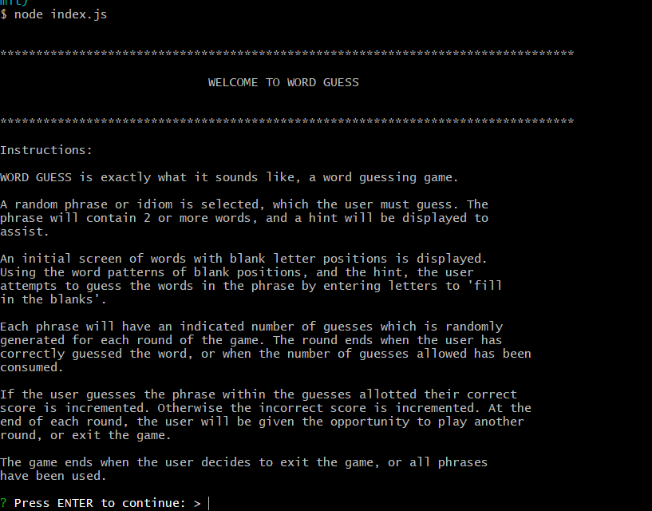
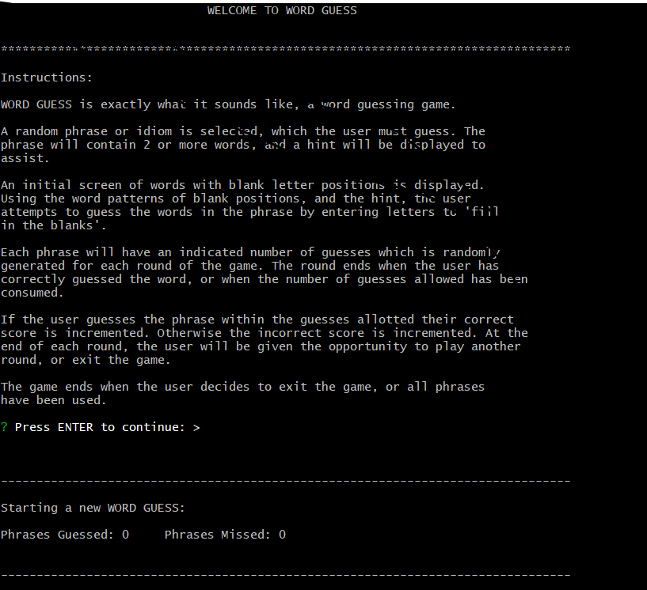
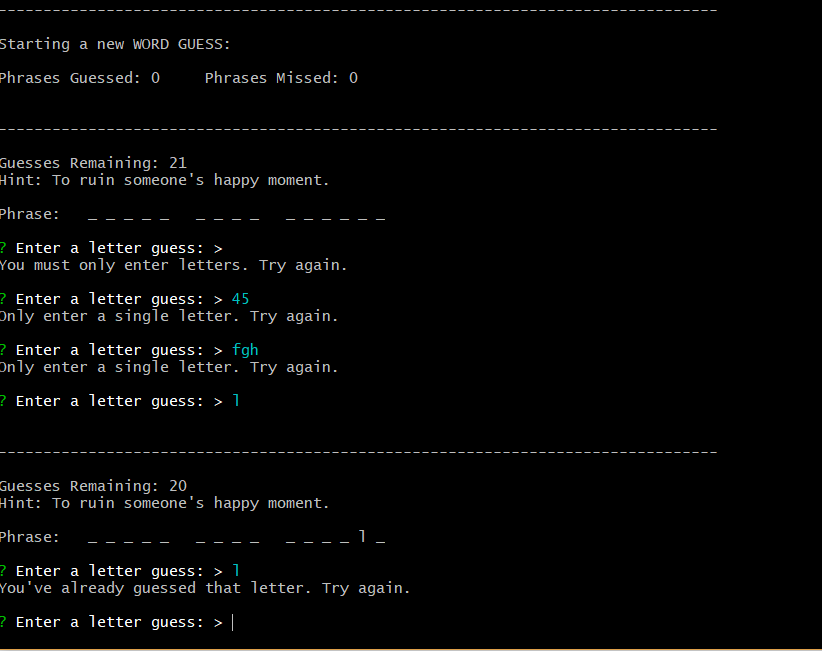
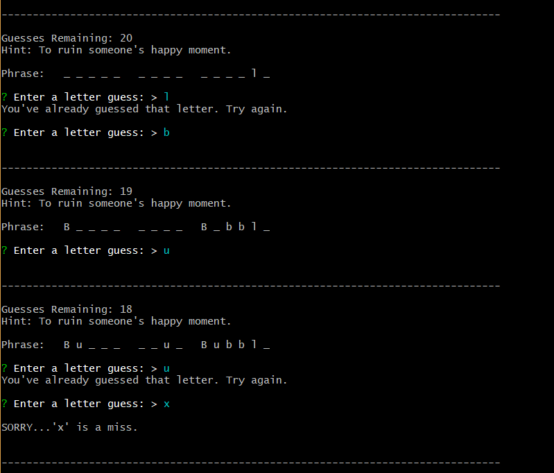
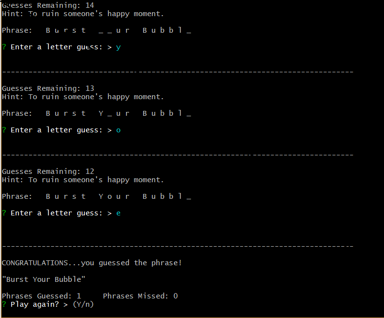
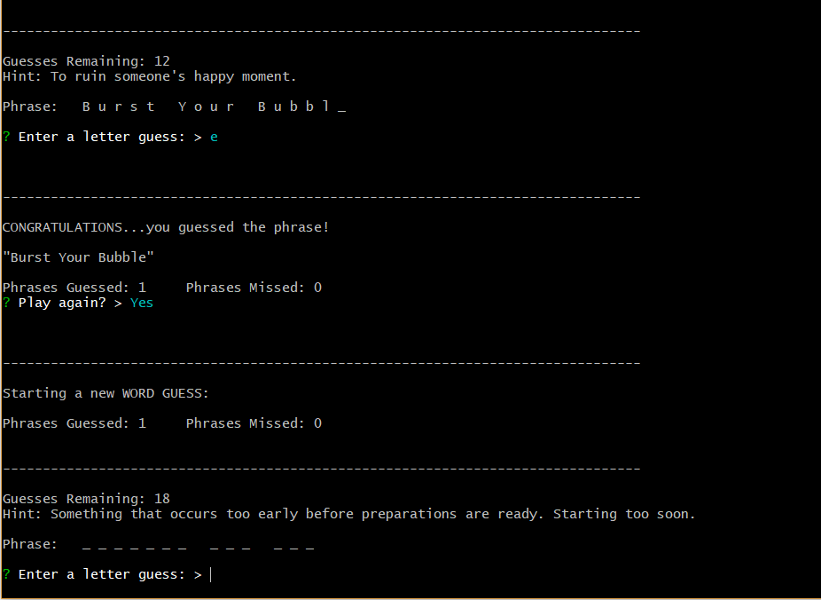
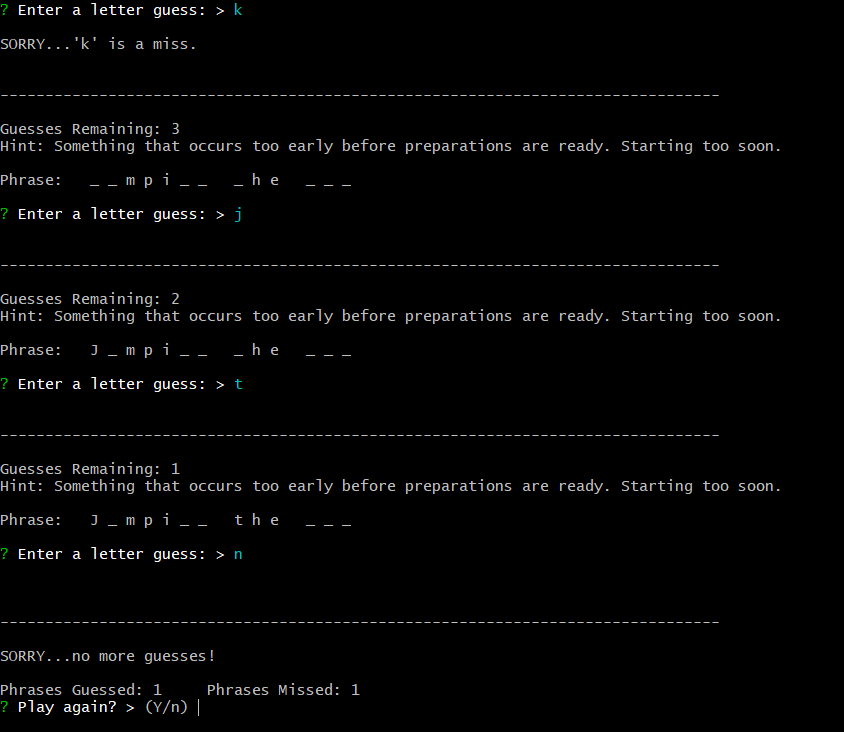

# Constructor Word Guess

### Overview

Word Guess is a command line word guess game. Each round of the game, a random
phrase or idiom is generated and displayed as a pattern of words and blank 
letters. The user is given a number of guesses based on the length of the
phrase. There is also a hint to assist the user in making their guesses.

### Dependencies

The only external requirement is `inquirer`. To install it use the following:
* **npm install inquirer**

Requirements that are part of the package include the following modules:
* word.js
* letter.js
* phrases.js

### Execution

The game is executed using node.js The below screenshots demonstrate the use
of the game.

Upon starting the game, an instruction page is displayed for the user, 
explaining how to play the game. Once the user has read the instructions,
they may press **ENTER**, and the game begins.

Each round of the game consists of selecting a random phrase or idiom to
be guessed by the user. A hint is displayed to assist the user with their
guessing.

The phrase is displayed as a pattern of words, each represented by a place
holder character, indicating the number of characters in the word. The user
attempts to guess the phrase entering a letter guess one at a time. If the
letter is not contained in the phrase, the number of guesses allowed is
decremented, and the user notified. If the letter is contained in the phrase,
each occurence is displayed in the word pattern, and the number of guesses
is decremented.

The number of guesses allowed is calculated for each phrase based on the
number of total characters in the phrase, and a factor to allow for misses.

If the phrase is guessed within the allotted guesses allowed, the player's
win score is incremented, and if not, the loss score is incremented.

At the end of each round, the player is asked whether they would like to 
play again. If so, another round begins, if not, the application terminates.

The game will continue until until the user has elected not to play again,
or there are no further phrases to select.

### Screenshots

The following screenshots illustrate the functionality of the application.

 The first screen the user will see
is the welcome screen with the game's instructions. After reading the
instructions, the user will press **ENTER** to continue.

 After pressing **ENTER** the
user will be presented with a **Starting New Game** screen, the current
score, a word pattern of the phrase to be guessed, and a hint to assist.

 There are several errors that can be detected,
such as not entering a letter, entering multiple letters, or entering a
letter that has already been entered.

 As letters are entered, the word pattern
is filled in, and remaining guesses decremented.

 Once the phrase is guessed,
the user is notified, and the score updated.

 Once the phrase is guessed, the user
is given an opportunity to play again.

 If the user runs out of guesses,
the round ends, and the user is given another opportunity to play.
